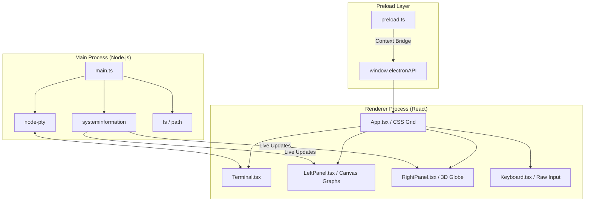

# 🟢 XTER-UI v2.0
> **The Ultimate Sci-Fi Terminal Emulator & System Monitor.**

[](https://www.electronjs.org/)
[](https://reactjs.org/)
[](https://www.typescriptlang.org/)
[](LICENSE)

XTER-UI is a high-performance desktop product that turns your workstation into a futuristic cyberdeck terminal. Inspired by *eDEX-UI*, it combines real shell access, live system telemetry, and an immersive sci-fi display system for daily terminal workflows.

---

## 📽️ Core Features

*   **⚡ 3-Stage Boot Sequence**: A high-fidelity initialization sequence featuring raw kernel logs, system service mounting, and ASCII logo authentication.
*   **📐 Structural CSS Grid**: A strict `100vw/100vh` layout engine utilizing `grid-template-areas`. No rounding, no shadows, just pure structural efficiency.
*   **📟 Real Terminal Engine**: Powered by `node-pty` and `xterm.js`, providing native shell access with 5 tabbed sessions.
*   **📊 Live Telemetry**: 
    *   **CPU**: Multi-core waveform visualizations rendered on HTML Canvas.
    *   **Memory**: A real-time 192-node dot-matrix occupancy tracker.
    *   **Network**: Global wireframe globe and traffic graphs.
*   **⌨️ Interactive Visual Keyboard**: A hardware-mapped virtual keyboard with custom logic for tabbed shell interaction.
*   **📂 Native File Explorer**: Programmatic icon rendering for folder navigation and disk usage monitoring.

---

## 🏗️ Technical Architecture

XTER-UI follows a strict separation of concerns between the **Electron Main Process** (Backend/Hardware) and the **React Renderer** (Frontend/Display).



### 🧠 Logic Deep-Dive (For AI Agents & Developers)

If you are an AI assistant or a developer contributing code, follow these internal logical patterns:

#### 1. Data Flow (The "Push" Model)
Avoid polling `systeminformation` in the frontend. `main.ts` maintains a 1-second interval loop that gathers telemetry and pushes it to the renderer via `webContents.send('sysinfo-update', data)`. 

#### 2. Performance Engineering (Canvas vs DOM)
*   **Waveforms & Graphs**: Always use `<canvas>`. React re-renders are too expensive for 60fps waveform animations.
*   **The Globe**: Uses `requestAnimationFrame` and basic trigonometric projections to render a wireframe sphere without the overhead of WebGL.
*   **Memory Dot Matrix**: Rendered via DOM nodes for accessibility, but optimized with React's `memo`.

#### 3. Styling "The Law"
The visual identity of XTER is non-negotiable. 
- **Borders**: `1px solid var(--border)`
- **Corners**: `border-radius: 0 !important`
- **Fonts**: `JetBrains Mono, monospace`
- **Coloring**: Use the mapped green variables in `hud.css`.

#### 4. Terminal Lifecycle
Terminals are NOT recreated on tab switch. They are initialized once and hidden/shown via `display: none`. This preserves session state. The `FitAddon` must be manually triggered on initialization and window resize.

---

## 🧪 Installation & Setup

### Prerequisites
- **Node.js**: v18.0.0 or higher.
- **Native Tools**: Required for `node-pty` compilation.
  - *Linux*: `sudo apt install build-essential python3`
  - *macOS*: `xcode-select --install`
  - *Windows*: `npm install --global windows-build-tools`

### Getting Started
1. **Clone & Install**:
   ```bash
   git clone https://github.com/GujjetiMokshithcode/xter-ui.git
   cd xter-ui
   npm install
   ```

2. **Development Mode**:
   Launch concurrently with Vite HMR and Electron:
   ```bash
   npm run dev
   ```

3. **Start Electron (without Vite)**:
   ```bash
   npm start
   ```

4. **Build Binary**:
   Compress for production:
   ```bash
   npm run build
   ```

5. **Lint**:
   ```bash
   npm run lint
   ```

---

## 📡 IPC API Reference
Access these via `window.electronAPI`:

| Method | Description |
| :--- | :--- |
| `terminal.create(id)` | Initializes a new PTY shell for a specific tab ID. |
| `terminal.input(id, data)` | Pipes keystrokes or data into the backend shell. |
| `terminal.onOutput(id, callback)` | Listens for shell output (ANSI codes). |
| `sysinfo.onUpdate(callback)` | Global listener for telemetry (CPU, Mem, Net). |
| `app.quit()` | Cleanly terminates the Electron process. |

---

## 📜 License
MIT License. Feel free to fork and build your own HUD.
